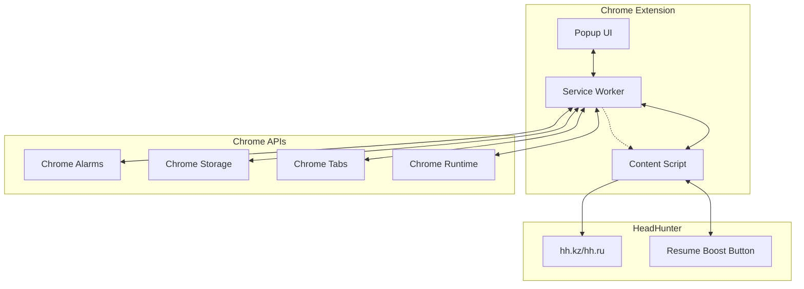

# 🏗️ System Architecture Overview

## 🎯 Архитектурная схема



## 🔧 Компоненты системы

### 1. Service Worker (Background Script)
**Файл**: `src/background/serviceWorker.ts`
**Размер**: 1,952 строки
**Роль**: Центральный координатор всех операций

#### Основные классы:
```typescript
class PersistentAlarmManager {
  // Управление persistent таймерами
  // Автоматическое восстановление после перезапуска
}

class ErrorRecoverySystem {
  // Система восстановления после ошибок
  // Circuit breaker pattern
}

class PerformanceOptimizer {
  // Кэширование и оптимизация производительности
  // Debouncing частых операций
}

class TestingFramework {
  // Runtime тестирование системы
  // Валидация компонентов
}
```

#### Ключевые функции:
- **Timer Management**: Создание, управление и восстановление таймеров
- **Tab Discovery**: Поиск и отслеживание вкладок с резюме
- **Error Handling**: Обработка ошибок и автоматическое восстановление
- **State Persistence**: Сохранение состояния в Chrome Storage
- **Communication Hub**: Координация между компонентами

### 2. Content Script
**Файл**: `src/content/resumeBooster.ts`
**Размер**: 553 строки
**Роль**: Взаимодействие с DOM страниц HeadHunter

#### Основные функции:
```typescript
class ResumeBooster {
  findBoostButton(): HTMLElement | null
  clickBoostButton(): Promise<boolean>
  isResumeBoostAvailable(): boolean
  handleMessage(message: any): Promise<any>
}
```

#### Ключевые возможности:
- **Button Detection**: Поиск кнопки "Поднять в поиске"
- **Click Automation**: Автоматическое нажатие кнопки
- **State Reporting**: Отчет о состоянии страницы
- **Error Handling**: Обработка DOM-related ошибок

### 3. Popup Interface
**Файлы**: `src/popup/popup.ts`, `popup.html`, `popup.css`
**Размер**: 899 строк общий
**Роль**: Пользовательский интерфейс

#### Основные функции:
- **Settings Management**: Настройка интервалов и параметров
- **Status Display**: Отображение текущего состояния
- **Manual Controls**: Ручное управление таймерами
- **Real-time Updates**: Обновление статуса в реальном времени

## 🔄 Потоки данных

### 1. Timer Flow
```
Service Worker → Chrome Alarms → Service Worker → Content Script → DOM
```

### 2. Settings Flow
```
Popup → Service Worker → Chrome Storage → Service Worker → Content Script
```

### 3. Status Flow
```
Content Script → Service Worker → Chrome Storage → Popup
```

## 🛡️ Системы надежности

### 1. Timer Persistence
```typescript
// Автоматическое восстановление таймеров
chrome.runtime.onStartup.addListener(() => {
  persistentAlarmManager.restoreState();
});
```

### 2. Error Recovery
```typescript
class CircuitBreaker {
  private failures: number = 0;
  private lastFailureTime: number = 0;
  private state: 'CLOSED' | 'OPEN' | 'HALF_OPEN' = 'CLOSED';
}
```

### 3. Communication Reliability
```typescript
async function sendMessageWithRetry(
  tabId: number, 
  message: any, 
  maxRetries: number = 3
): Promise<any> {
  // Exponential backoff retry logic
}
```

## 📊 Performance Architecture

### 1. Caching Layer
```typescript
class PerformanceOptimizer {
  private cache: Map<string, CacheEntry> = new Map();
  private debouncedFunctions: Map<string, Function> = new Map();
}
```

### 2. Batch Operations
```typescript
class BatchOperationsManager {
  private pendingOperations: Operation[] = [];
  private batchTimer: NodeJS.Timeout | null = null;
}
```

### 3. Memory Management
- **Automatic cleanup**: Удаление устаревших данных
- **Efficient storage**: Оптимизация размера данных
- **Garbage collection**: Предотвращение memory leaks

## 🔐 Security Considerations

### 1. Content Security Policy
```json
{
  "content_security_policy": {
    "extension_pages": "script-src 'self'; object-src 'self'"
  }
}
```

### 2. Permissions
```json
{
  "permissions": [
    "storage",
    "alarms", 
    "tabs",
    "activeTab",
    "scripting"
  ],
  "host_permissions": [
    "https://hh.kz/*",
    "https://hh.ru/*"
  ]
}
```

### 3. Data Protection
- **Local storage only**: Никаких внешних серверов
- **Encrypted sensitive data**: Шифрование критичных данных
- **Minimal permissions**: Только необходимые разрешения

## 🧪 Testing Architecture

### 1. Runtime Testing
```typescript
class TestingFramework {
  async runSystemTests(): Promise<TestResults> {
    // 7 категорий тестов
    // Автоматическое выполнение в dev mode
  }
}
```

### 2. Component Testing
- **Timer Management**: Тестирование создания/удаления таймеров
- **Tab Detection**: Валидация поиска вкладок
- **Communication**: Проверка message passing
- **Error Recovery**: Тестирование восстановления

## 📈 Scalability Considerations

### 1. Multiple Resumes
- **Concurrent processing**: Параллельная обработка до 2 резюме
- **Independent timers**: Независимые таймеры для каждого резюме
- **Resource isolation**: Изоляция ресурсов между процессами

### 2. Performance Scaling
- **Debouncing**: Оптимизация частых операций
- **Caching**: Кэширование результатов поиска
- **Batch processing**: Группировка операций

### 3. Error Handling Scaling
- **Circuit breaker**: Предотвращение cascade failures
- **Exponential backoff**: Адаптивные retry интервалы
- **Graceful degradation**: Постепенное снижение функциональности

## 🔮 Future Architecture

### 1. Модульность
```typescript
// Планируемая модульная архитектура
interface ExtensionModule {
  initialize(): Promise<void>;
  cleanup(): Promise<void>;
  getStatus(): ModuleStatus;
}
```

### 2. Plugin System
- **Timer Strategies**: Различные стратегии таймеров
- **UI Themes**: Настраиваемые темы интерфейса
- **Analytics Modules**: Модули аналитики

### 3. Advanced Features
- **Machine Learning**: Оптимизация времени обновления
- **A/B Testing**: Тестирование различных подходов
- **Real-time Analytics**: Мониторинг в реальном времени 